# Sort Algorithm

## 选择排序

> **原理：**  

> > 选择最小的数放在第一个，以此类推。。。

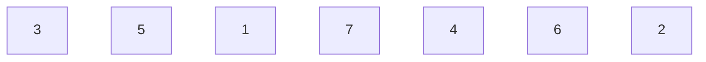

> > setp1: 

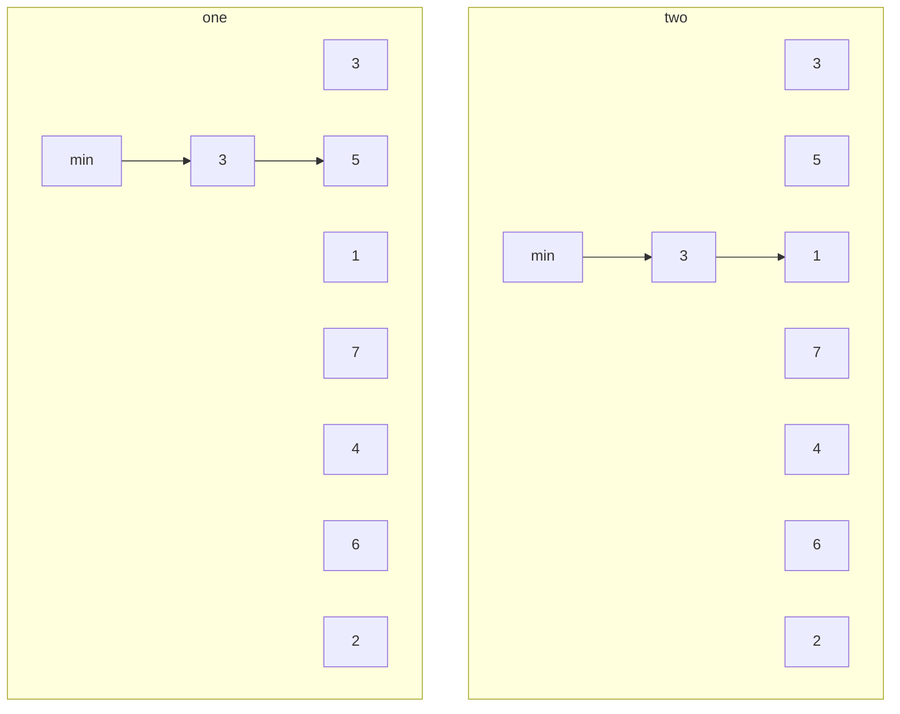

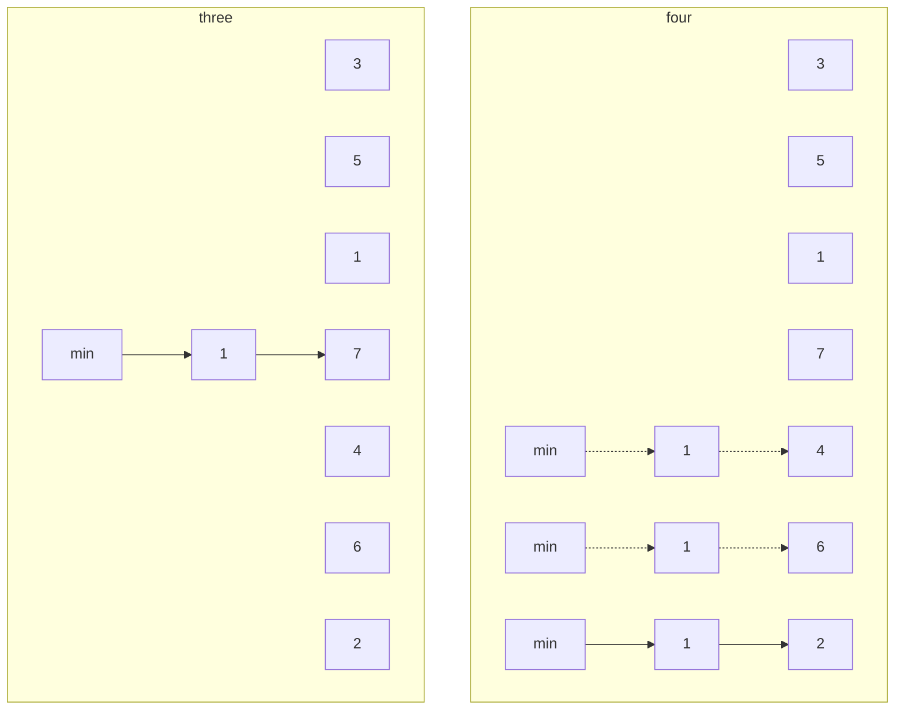

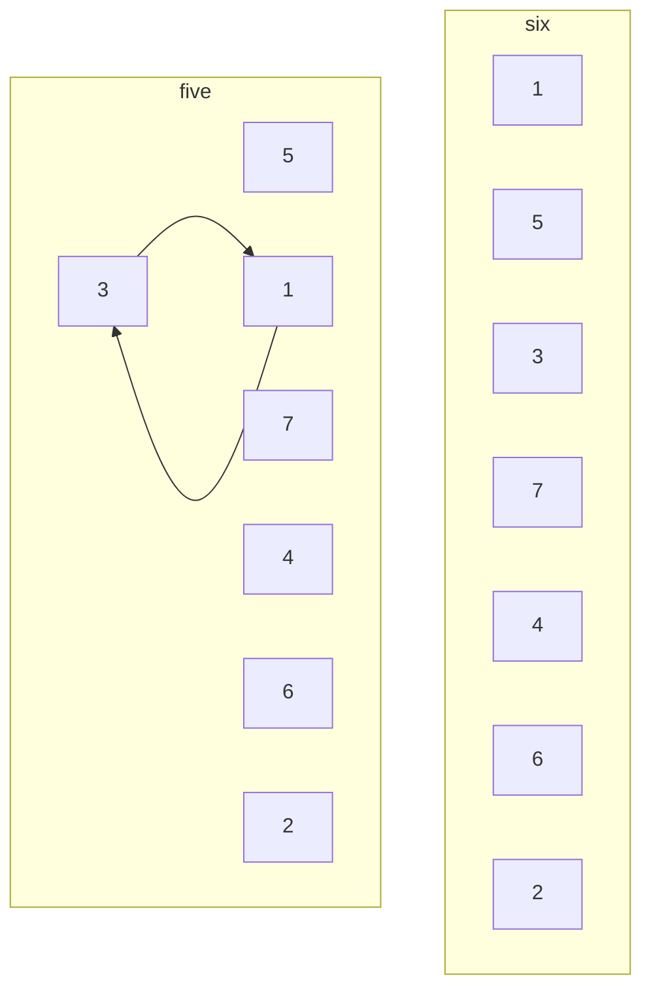

> > step2:

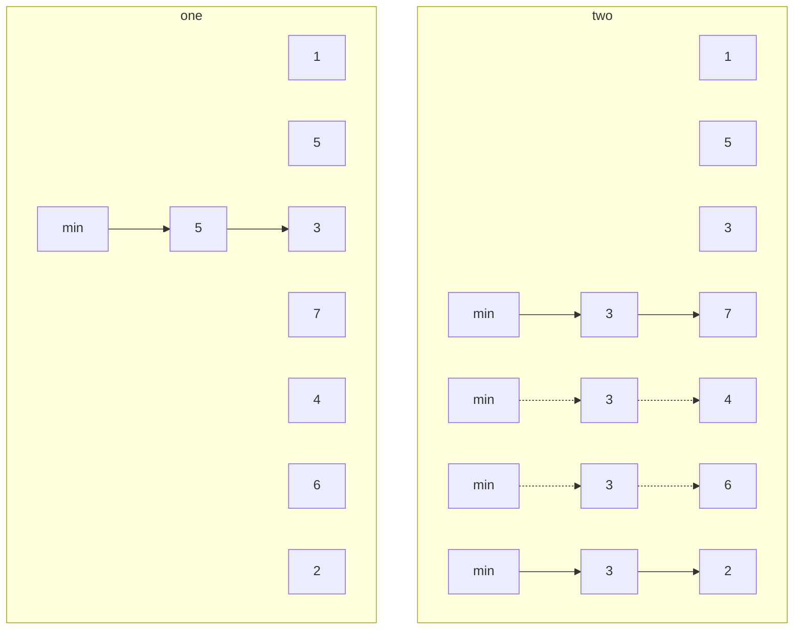

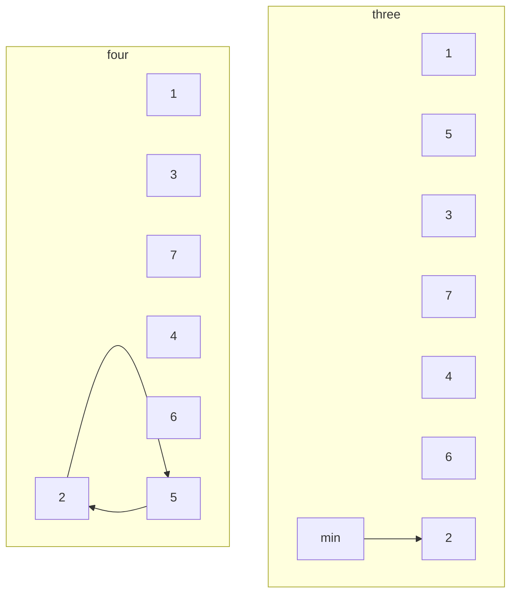

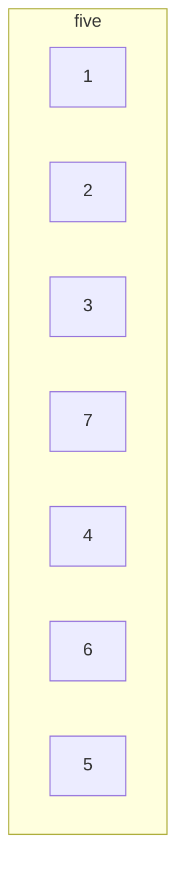


> > stepN:

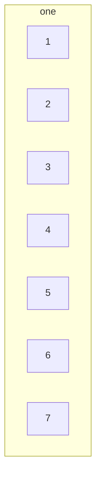

> **Code:**

> > **python:**

```python
Array = list(map(int,input("please input the array(split by space):").split()))

def selection_sort(a):
    for i in range(len(a)):
        min_key = i
        for j in range(i + 1, len(a)):
            if a[j] < a[min_key]:
                min_key = j
        a[i], a[min_key] = a[min_key], a[i]
    return a

def main():
    print("input is: ",Array)
    SortedArray = selection_sort(Array)
    print("result is: ", SortedArray)


if __name__ == "__main__":
    main()


```

> > **C++:**

```C++
#include <iostream>
#include <stdlib.h>
#include <vector>

using namespace std;

void print_array(auto array)
{
    for(int i : array)
    {
        cout << i << " ";
    }
    cout << endl;
}

void selection_sort(auto &array)
{
    auto len = array.size();
    for (int i = 0; i < len; i++)
    {
        int key = i;
        for(int j = i+1; j < len; j++)
        {
            if(array[j] < array[key])
            {
                key = j;
            }
        }
        if(key != i)
        {
            int temp = array[i];
            array[i] = array[key];
            array[key] = temp;
        }
    }
}

int main()
{  
    vector<int> array;
    char ch;
    cout << "please input the array(split by space):";
    while((ch = cin.get()) != '\n')
    {
        if(ch != ' ')
            array.push_back(int(ch - '0'));
    }
    cout << "origin is: " ;
    print_array(array);

    selection_sort(array);
    cout << "result is: " ;
    print_array(array);

    system("pause");
    return 0;
}
```


> **result:**

```
please input the array:3 5 7 1 4 6 2
input is:  [3, 5, 7, 1, 4, 6, 2]
result is:  [1, 2, 3, 4, 5, 6, 7]
```


> **复杂度：**

- 假如数组的长度是N，则时间复杂度：

  进行比较的次数：(N-1)+(N-2)+……+1 = N(N-1)/2

  进行交换的次数：N

  

  选择排序的交换操作介于 0 和 (n - 1） 次之间。选择排序的比较操作为 n (n - 1） / 2 次之间。选择排序的赋值操作介于 0 和 3 (n - 1） 次之间。

  比较次数O(n^2），比较次数与关键字的初始状态无关，总的比较次数N=(n-1）+(n-2）+...+1=n*(n-1）/2。交换次数O(n），最好情况是，已经有序，交换0次；最坏情况交换n-1次，逆序交换n/2次。

- 特点：（稳定）

  1. 运行时间与输入无关。因为前一次的扫描并不能为后面的提供信息。
  2. 数据的移动次数是最小的。


## 插入排序

> **原理：**

> > 比较当前数与前一个数的大小，小的话交换，在比较与前面一个，以此类推


> > step 1:

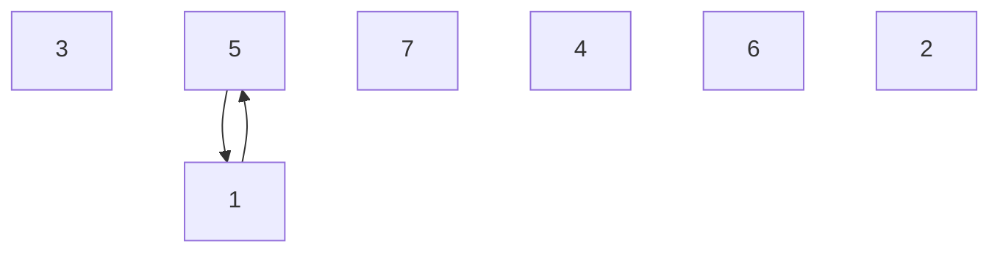

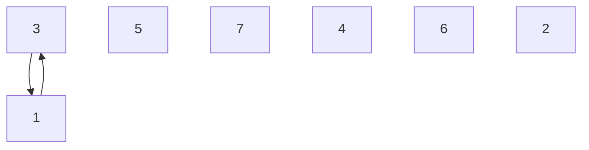

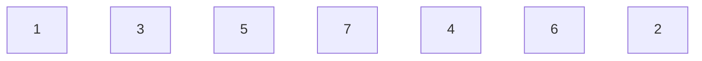

> > step 2:

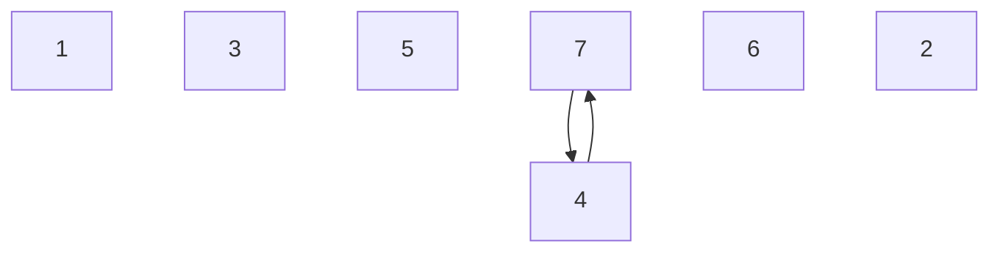

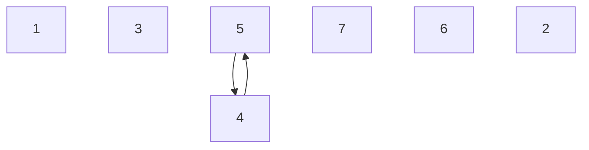

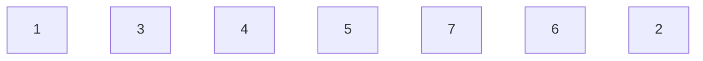


> > step N:

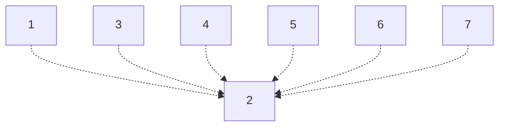

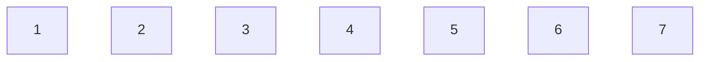

> **Code:**

> > **python:**

```python
def insertion_sort(a):
    k =0
    for i in range(1, len(a)):
        if(a[i]<a[i-1]):
            k = k+1
            for j in range(i, 0, -1):
                if(a[j] < a[j-1]):
                    a[j-1], a[j] = a[j], a[j-1]
            print("after %d change: "%k, a)
    return a

def main():
    Array = list(map(int,input("please input the array(split by space):").split()))
    print("input is: ", Array)
    SortedArray = insertion_sort(Array)
    print("result is: ", SortedArray)


if __name__ == "__main__":
    main()

```

> > **C++:**

```C++
#include <iostream>
#include <stdlib.h>
#include <vector>

using namespace std;

void print_array(auto array)
{
    for(int i : array)
    {
        cout << i << " ";
    }
    cout << endl;
}

void insertion_sort(auto &array)
{
    auto len = array.size();
    int k = 0;
    for (int i = 1; i < len; i++)
    {
        if (array[i] < array[i-1])
        {
            for (int j = i; j > 0; j--)
            {
                if (array[j] < array[j-1])
                {
                    auto temp = array[j-1];
                    array[j-1] = array[j];
                    array[j] = temp;
                }
            }
            cout << "after " << ++k << " change: ";
            print_array(array);
        }
    }
}

int main()
{  
    vector<int> array;
    char ch;
    cout << "please input the array(split by space):";
    while((ch = cin.get()) != '\n')
    {
        if(ch != ' ')
            array.push_back(int(ch - '0'));
    }
    cout << "origin is: " ;
    print_array(array);

    insertion_sort(array);
    cout << "result is: " ;
    print_array(array);

    system("pause");
    return 0;
}
```

> **result:**

```
please input the array(split by space):3 5 4 1 7 6
input is:  [3, 5, 4, 1, 7, 6]
after 1 change:  [3, 4, 5, 1, 7, 6]
after 2 change:  [1, 3, 4, 5, 7, 6]
after 3 change:  [1, 3, 4, 5, 6, 7]
result is:  [1, 3, 4, 5, 6, 7]
```

> > **复杂度：**

- 若数组的长度是N（不重复 ），则时间复杂度：

  1. 平均：N*N/4 次比较，N*N/4次交换
  2. 最好：N-1次比较，0次交换
  3. 最坏：N*N/2次比较， N*N/2次交换

- 特点：

  若数据倒置的数量很少时，速度快。


## 冒泡排序

> **原理：**

 冒泡排序的原理就是小的数字慢慢的往上浮。从数组最后面开始循环，如果一个数比它前面数小，则交换两者位置。 


> > step 1:

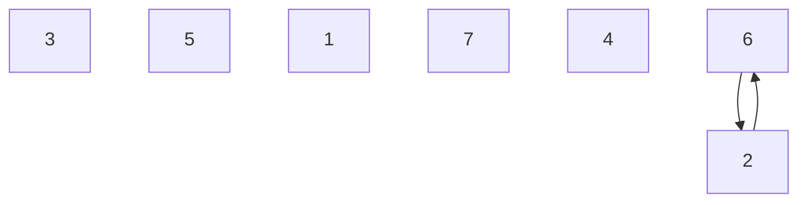

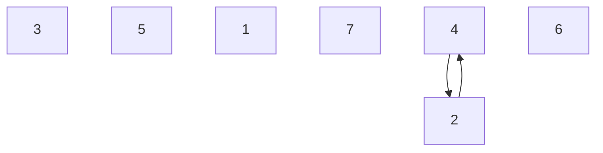

```mermaid
graph TB;
1[3]
2[5]
3[1]
4[7] --> 5
5[2] --> 4
6[4] 
7[6] 
```

```mermaid
graph TB;
1[3]
2[5]
3[1] --> 4
4[2] --> 3
5[7] 
6[4] 
7[6] 
```

```mermaid
graph TB;
1[3]
2[5] --> 3
3[1] --> 2
4[2]
5[7] 
6[4] 
7[6] 
```

```mermaid
graph TB;
1[3] --> 2
2[1] --> 1
3[5] 
4[2]
5[7] 
6[4] 
7[6] 
```

```mermaid
graph TB;
1[1] 
2[3] 
3[5] 
4[2]
5[7] 
6[4] 
7[6]
```

> > step 2:

```mermaid
graph TB;
1[1] 
2[3] 
3[5] 
4[2]
5[7] 
6[4] --> 7
7[6] --> 6
```

```mermaid
graph TB;
1[1] 
2[3] 
3[5] 
4[2]
5[7] --> 6
6[4] --> 5
7[6] 
```

```mermaid
graph TB;
1[1] 
2[3] 
3[5] 
4[2] --> 5
5[4] --> 4
6[7]
7[6] 
```

```mermaid
graph TB;
1[1] 
2[3] 
3[5] --> 4
4[2] --> 3
5[4] 
6[7]
7[6] 
```

```mermaid
graph TB;
1[1] 
2[3] --> 3
3[2] --> 2
4[5] 
5[4] 
6[7]
7[6] 
```

```mermaid
graph TB;
1[1] --> 2
2[2] --> 1
3[3]
4[5] 
5[4] 
6[7]
7[6] 
```

```mermaid
graph TB;
1[1]
2[2] 
3[3]
4[5] 
5[4] 
6[7]
7[6] 
```

> > step 3:

```mermaid
graph TB;
1[1]
2[2] 
3[3]
4[5] 
5[4] 
6[7] --> 7
7[6] --> 6
```

```mermaid
graph TB;
1[1]
2[2] 
3[3]
4[5] 
5[4] --> 6
6[6] --> 5
7[7] 
```

```mermaid
graph TB;
1[1]
2[2] 
3[3]
4[5] --> 5
5[4] --> 4
6[6]
7[7] 
```

```mermaid
graph TB;
1[1]
2[2] 
3[3]
4[4]
5[5] 
6[6]
7[7] 
```

> **Code:**

```python
def bubble_sort_ascended(a):
    k =0
    for i in range(0, len(a)):
        flag = False
        k = k + 1
        for j in range(len(a)-1, i, -1):
            if(a[j] < a[j-1]):
                flag = True
                a[j], a[j-1] = a[j-1], a[j]
        if(not flag):
            break
        print("after %d change: "%k, a)
    return a

def bubble_sort_dascended(a):
    k =0
    for i in range(0, len(a)):
        flag = False
        k = k + 1
        for j in range(len(a)-1, i, -1):
            if(a[j] > a[j-1]):
                flag = True
                a[j], a[j-1] = a[j-1], a[j]
        if(not flag):
            break
        print("after %d change: "%k, a)
    return a

def main():
    Array = list(map(int,input("please input the array(split by space):").split()))
    print("input is: ", Array)
    SortedArrayAscend = bubble_sort_ascended(Array)
    print("ascend result is: ", SortedArrayAscend)

    SortedArrayDascend = bubble_sort_dascended(Array)
    print("dascend result is: ", SortedArrayDascend)

if __name__ == "__main__":
    main()
```

```C++
#include <iostream>
#include <stdlib.h>
#include <vector>

using namespace std;

void print_array(auto array)
{
    for(int i : array)
    {
        cout << i << " ";
    }
    cout << endl;
}

void bubble_sort(auto &array)
{
    auto len = array.size();
    int k = 0;
    for (int i = 0; i < len; i++)
    {
        bool flag = false;
        for (int j = len - 1; j > i; j--)
        {
            if (array[j] < array[j-1])
            {
                flag = true;
                auto temp = array[j-1];
                array[j-1] = array[j];
                array[j] = temp;
            }
        }
        
        if(not flag)
        {
            break;
        }

        cout << "after " << ++k << " change: ";
        print_array(array);
    }
}

int main()
{  
    vector<int> array;
    char ch;
    cout << "please input the array(split by space):";
    while((ch = cin.get()) != '\n')
    {
        if(ch != ' ')
            array.push_back(int(ch - '0'));
    }
    cout << "origin is: " ;
    print_array(array);

    bubble_sort(array);
    cout << "result is: " ;
    print_array(array);

    system("pause");
    return 0;
}
```

> **result:**

```
please input the array(split by space):3 5 1 7 4 6 2
input is:  [3, 5, 1, 7, 4, 6, 2]
after 1 change:  [1, 3, 5, 2, 7, 4, 6]
after 2 change:  [1, 2, 3, 5, 4, 7, 6]
after 3 change:  [1, 2, 3, 4, 5, 6, 7]
ascend result is:  [1, 2, 3, 4, 5, 6, 7]
```

> **复杂度：**

- 若数组的长度是N（不重复 ），则时间复杂度：

  1. 平均：N*N/4 次比较，N*N/4次交换
  2. 最好：N-1次比较，0次交换
  3. 最坏：N*N/2次比较， N*N/2次交换

- 特点：

  若数据倒置的数量很少时，速度快。

